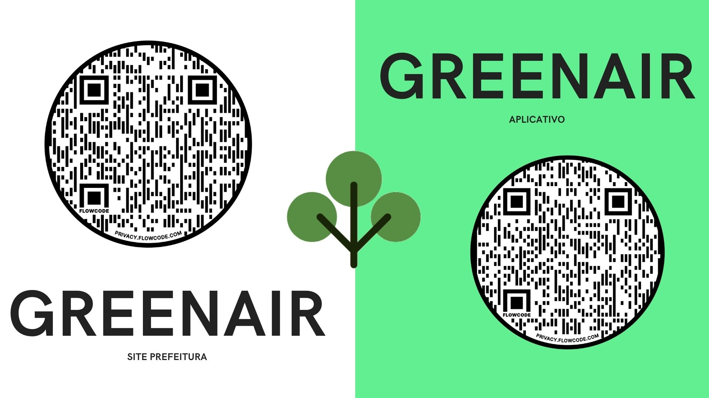

<h1 align="center">
    
</h1>
<h1 align="center">GreenAir 🌳</h1>
<p align="center">
  

  <a href="https://github.com/leoyoshii/GreenAir-AEP-ADSIS5S-N-A/commits/master">
    
  </a>
  <a href="http://makeapullrequest.com">
    
  </a>
  
   <a href="https://github.com/leoyoshii/GreenAir-AEP-ADSIS5S-N-A/stargazers">
    
  </a>
</p>

<details open="open">
  <summary><h2 style="display: inline-block">Table of Contents</h2></summary>
  <ol>
    <li>
      <a href="#about-the-project">About The Project</a>
      <ul>
        <li><a href="#🛠-built-with">Built With</a></li>
      </ul>
      <ul>
        <li><a href="#🎨-layout">Layout</a></li>
      </ul>
    </li>
    <li>
      <a href="#getting-started">Getting Started</a>
      <ul>
        <li><a href="#prerequisites">Prerequisites</a></li>
        <li><a href="#installation">Installation</a></li>
      </ul>
    </li>
    <li><a href="#usage">Usage</a></li>
    <li><a href="#contributing">Contributing</a></li>
    <li><a href="#license">License</a></li>
    <li><a href="#contributors">Contributors</a></li>
  </ol>
</details>

## About The Project

<h1 align="center">
    
</h1>

GreenAir consists of an application that focuses on environmental education in the city of Maringá, PR - Brazil

The app will raise awareness through posts, tips and daily messages in our feed. In addition to the possibility of reporting condemned trees or requesting a new planting area.

### 🛠 Built With

- [Node.js](https://nodejs.org/)
- [Express](https://expressjs.com/)
- [Typescript](https://www.typescriptlang.org/)
- [TypeOrm](https://typeorm.io/#/)
- [PostgreSQL](https://www.postgresql.org/)
  and more...

### 🎨 Layout

O layout da aplicação está disponível no Marvel:

<a href="https://marvelapp.com/prototype/gea0b50/screen/79895101">
  
</a>

## Getting Started

### Prerequisites

Before starting, you will need to have the following tools installed on your machine:
[Git](https://git-scm.com), [Node.js](https://nodejs.org/en/), [PostgreSQL](https://www.postgresql.org/).
Also it's nice to have an editor to work with the code like [VSCode](https://code.visualstudio.com/)

### Installation

1. Clone the repo, access the project folder

```bash
git clone https://github.com/leoyoshii/GreenAir-AEP.git

cd GreenAir-AEP
```

2. Install NPM packages

```bash
npm install
or
yarn install
```

3. Create the `.env` file. You can duplicate `.env.example` and change the variables

4. Create the `ormconfig.json` file. You can duplicate `ormconfig.example.json` and change the variables

5. Create a table in the database with name specified in `ormconfig.json`

6. Run migrations

```bash
npm run typeorm migration:run
or
yarn typeorm migration:run
```

7. Run the application in development mode

```bash
npm run dev:server
or
yarn dev:server
```

## Usage

To make requests use Insomnia. You can import the `Insomnia_greenair.json` file for examples.

## Contributing

Any contributions are **greatly appreciated**.

1. Fork the Project
2. Create your Feature Branch (`git checkout -b feature/yourFeature`)
3. Commit your Changes (`git commit -m 'Add some yourFeature'`)
4. Push to the Branch (`git push origin feature/yourFeature`)
5. Open a Pull Request

## License

Distributed under the MIT License. See LICENSE for more information.

## Contributors

<table>
  <tr>
    <td align="center"><a href="https://github.com/leoyoshii"><br /><sub><b>Leonardo Yoshii</b></sub></a><br /></td>
    <td align="center"><a href="https://github.com/GuilhermeLaverde"><br /><sub><b>Guilherme Laverde</b></sub></a><br /></td>
    <td align="center"><a href="https://github.com/lanjoni01"><br /><sub><b>Leonardo Lanjoni</b></sub></a><br /></td>
    <td align="center"><a href="https://github.com/gustavo-cesar"><br /><sub><b>Gustavo Cesar</b></sub></a><br /></td>
    <td align="center"><a href="https://github.com/Guilherme-Freschi"><br /><sub><b>Guilherme Freschi</b></sub></a><br /></td>
  </tr>
